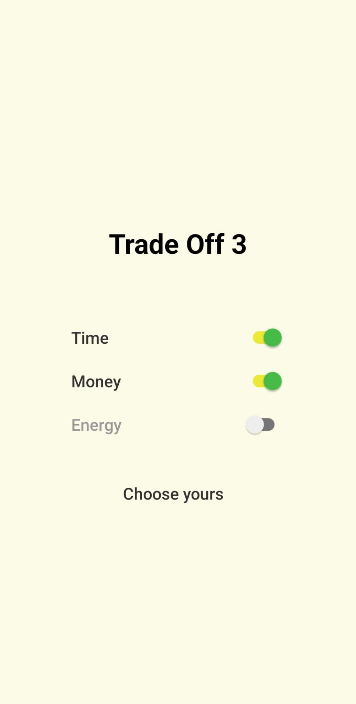

# Trade Off 3

A small React Native app that simulates the classic **“2 out of 3” paradox**.

## Concept

Initially illustrated with the example:

- Time  
- Money  
- Energy  

The idea is that you can realistically optimize only **two out of three** at the same time, improving one often impacts the others.

While the default model uses these three resources, it can be extended to represent other trade-off scenarios.

## Goal

This project was built to:

- Simulate trade-off dynamics through interactive switches  
- Practice state management in React Native  
- Explore conditional logic between UI controls  

## Tech

- React Native  
- Expo  

## Screenshot

## Next

Planned improvements:

- Refactor logic  
- Create reusable components  
- Introduce `useReducer` for state management  